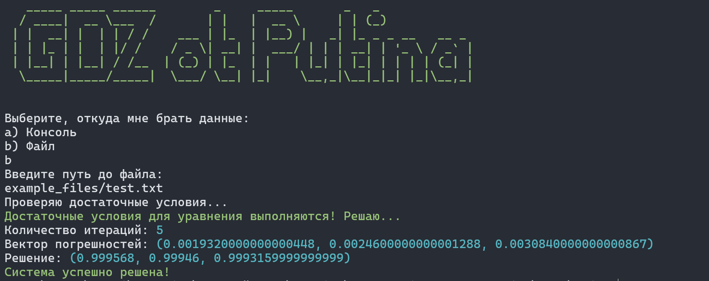
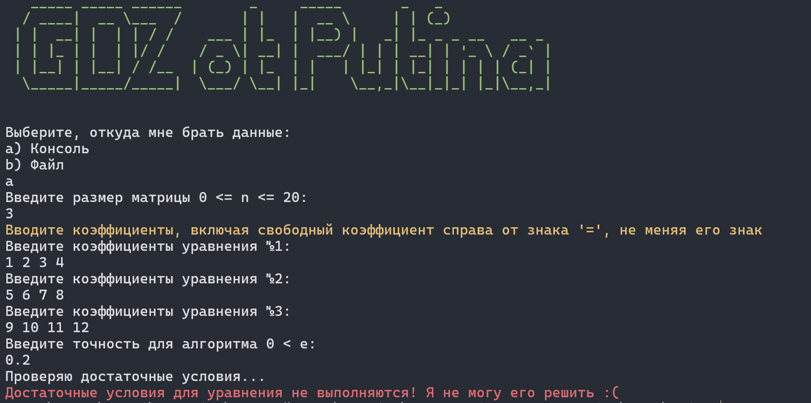

# Lab1 (GDZ OT PUTINA)
 
Simple program on python that's can solve equations systems through ***simple iterations method***

### Below I have given a brief instruction on how to use it

1 Файл
* Файл делится на 3 блока
* Первая строка содержит одно целое число n - количество уравнений в системе 
* cледующие n строк содержат n+1 чисел с плавающей точкой, разделенные пробелом (n + 1) со свободным членом после знака равно
* последняя строчка задает точность - число с плавающей точкой

2 Консоль
* Идентична файлу, для ввода программа сама приглашает пользователя
### Пример файла
```
3
2 2 10 14 # x + 3y + 2z = 6
10 1 1 12 # 4x - 7z = 0
2 10 1 13 # 5x = 2
0.01 # с точностью 0.1
```
### Немного фотографий

#### Обычный вывод



#### Пример одной из ошибок

