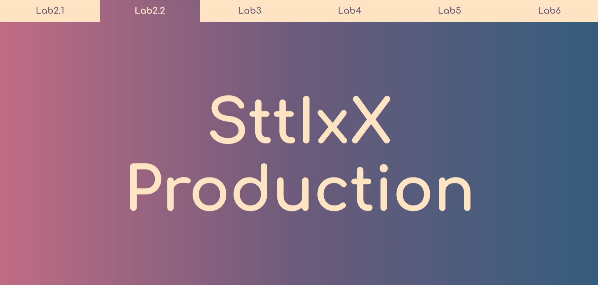
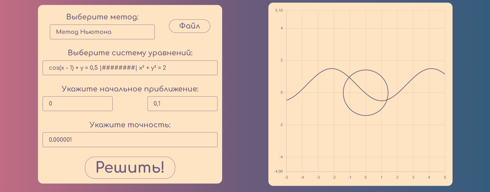
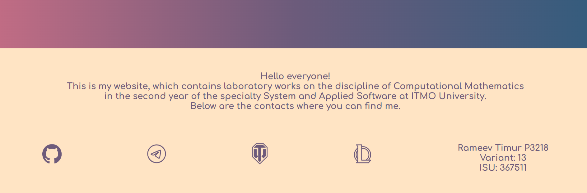

# Лабораторная работа №2 по вычислительной математике 

 Нужно было реализовать графический интерфейс, для программы, которая ищет корни нелинейных уравнений, а также систем нелинейных уравнений. С дизайном я решил слегка заморочиться )))

 ## Backend

Написан на питоне, реализует 3 метода нахождения корня нелинейного уравнения: 

* Метод половинного деления

* Метод секущих

* Метод простых итераций

А также один метод для нахождения корней системы уравнений:

* Метод Ньютона

В качестве сервера использую Fast-api веб фреймворк

## Frontend

Написан на Vue. Также использовал Prime Vue для слайдера. делал кастомную тему для него, для этого пришлось настраивать под себя css размером 10к строк. Его уж заливать не буду, а то мой репозиторий на 99.9 % будет состоять из css. Ну что еще сказать. Мне понравилось, на мой взгляд неплохой внешний вид сайта получился.

## Вот пару скринов самого сайта

